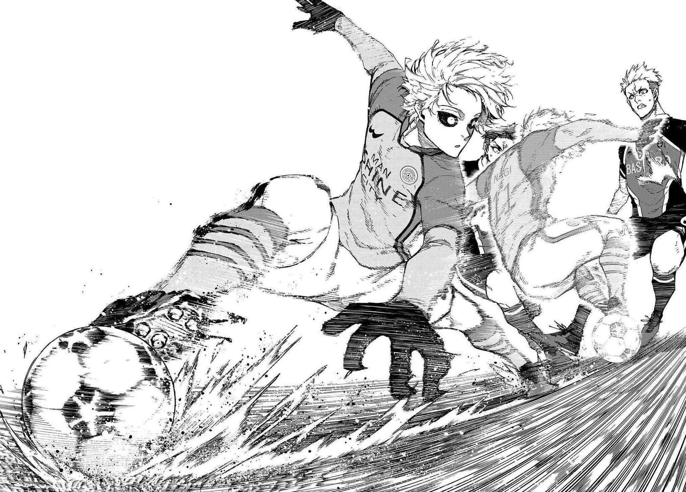

### Hi!👋 I'm Beni

**Web Developer and Gamer** 

## **☕ About me**

I'm Beni. I enjoy gaming, watching anime, and exploring new coding projects. My interests are diverse, and I'm always eager to learn something new.
   

## **💻 Experience**

Previously worked at RAYA specializing in ERPNext. Graduated from <a href="https://qcu.edu.ph/">Quezon City University (QCU)</a> with a Bachelor of Science in Information Technology (BSIT). I believe in continuous learning and strive to improve every day, eager to make a meaningful impact in the future.

<!-- ## **Tech Stack**
 -->

## **📊 Github Stats**

  
  

## **📫 Contact**

**You can also email me here:** jbeni.tech@gmail.com
